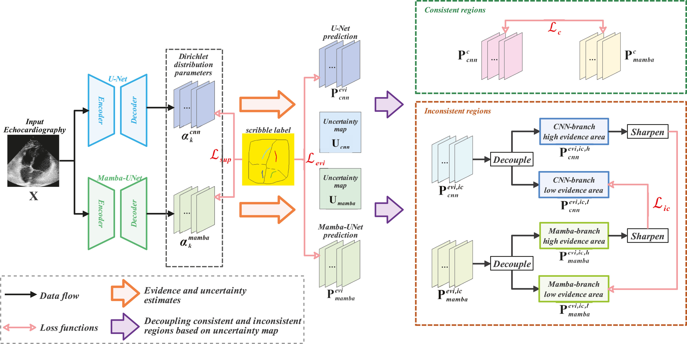

# MambaEviScrib: Mamba and evidence-guided consistency enhance CNN robustness for scribble-based weakly supervised ultrasound image segmentation
by [Xiaoxiang Han](https://linyer.ac.cn/), Xinyu Li, [Jiang Shang](https://scholar.google.com/citations?user=-jM7c_YAAAAJ), [Yiman Liu](https://linyer.ac.cn/authors/yiman-liu/), Keyan Chen, [Shugong Xu](https://scie.shu.edu.cn/Prof/xusg.htm), [Qiaohong Liu](https://yjsjy.sumhs.edu.cn/lqh/main.htm), and [Qi Zhang](https://scie.shu.edu.cn/Prof/zhangq.htm).

## Introduction
This repository contains the official implementation of *MambaEviScrib*. The corresponding paper, titled "[MambaEviScrib: Mamba and evidence-guided consistency enhance CNN robustness for scribble-based weakly supervised ultrasound image segmentation](https://doi.org/10.1016/j.inffus.2025.103590)", has been published in *Information Fusion*. For any inquiries or issues, please contact [hanxx@shu.edu.cn](mailto:hanxx@shu.edu.cn).

## Contributions 
1. We propose a dual-branch scribble-based weakly supervised segmentation framework comprising CNN and Mamba, which respectively extract and fuse local and global features from ultrasound images.
2. The EGC strategy is developed to fully leverage predictions near decision boundaries, enhancing the stability of edge segmentation and the robustness of the model.
3. We design a pEDL loss function, and the supervised loss functions co-optimize the generation of pseudo-labels using the features of input images and ground truth, further enhancing edge segmentation performance.
4. To our best knowledge, we are the first to apply scribble-based WSL for ultrasound image segmentation. We will publicly release four ultrasound datasets along with their scribble annotations, as well as our code.

## Pipeline
The pipeline of the proposed framework:

The framework consists of a dual-branch network, including a CNN branch and a mamba branch, which capture local and global features, respectively. Based on evidence theory, the uncertainty of the outputs from both networks is estimated. For ambiguous regions where the outputs of the two networks are inconsistent, predictions near decision boundaries are optimized by leveraging high-evidence predictions to guide low-evidence ones.

## Dataset
The four ultrasound datasets used in this study (**CardiacUDA**, **EchoNet**, **BUSI**, and **DDTI**) are accessible on [](https://doi.org/10.5281/zenodo.16785434), and we have also released our generated **scribble** annotations.

The dataset folder structure is organized as follows: each `fold` represents one of the *N*-fold (5-fold in this study) cross-validation data folders, where the `images` subfolder contains ultrasound images, the `labels` subfolder stores the original dense labels, and the `scribble` subfolder holds the scribble annotations.
```bash
├── dataset
    ├── CardiacUDA
        ├── fold1
            ├── images
            ├── labels
            ├── scribble
        ├── fold2
        ├── fold3
        ├── fold4
        ├── fold5
    ├── EchoNet
    ├── BUSI
    ├── DDTI
```

## Usage
To train a binary segmentation task (background + foreground), execute the following command (ensure to modify the necessary paths and configurations accordingly):
```
./train_bin_class.sh
``` 

To train a multi-class segmentation task (including background class 0, with 5 classes by default in this work), execute the following command:
```
./train_multi_class.sh
``` 
To evaluate the model on the test set, run either `test.py` or `test_bin.py`.

## Citation
If you find these projects useful, please consider citing:

```bibtex
@article{han2026mambaeviscrib,
  title={MambaEviScrib: Mamba and evidence-guided consistency enhance CNN robustness for scribble-based weakly supervised ultrasound image segmentation},
  author={Han, Xiaoxiang and Li, Xinyu and Shang, Jiang and Liu, Yiman and Chen, Keyan and Xu, Shugong and Liu, Qiaohong and Zhang, Qi},
  journal={Information Fusion},
  volume={126},
  pages={103590},
  year={2026},
  publisher={Elsevier},
  doi={https://doi.org/10.1016/j.inffus.2025.103590}
}
```
## Acknowledgements
Our code was adapted from [WSL4MIS](https://github.com/HiLab-git/WSL4MIS). Thanks for their valuable works.